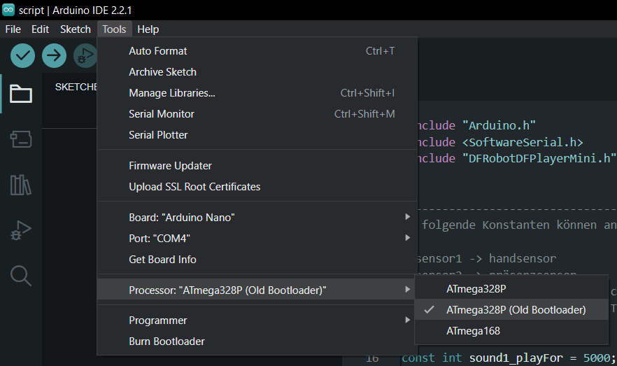
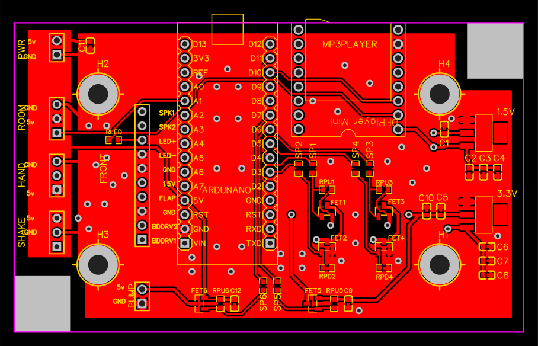
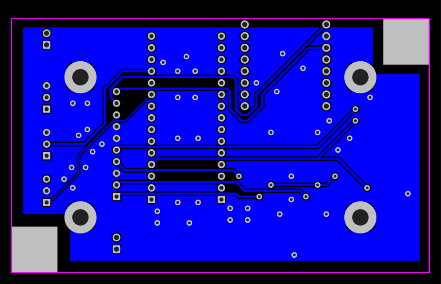
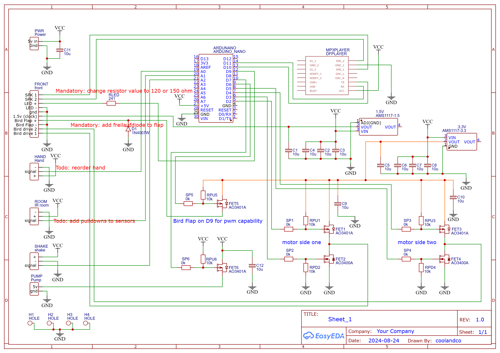

## KOOKOO
~~Very simple~~ script to control a Cuckoo, multiple sensors and sound playback.

## Connecting
Most of the cables have color codes at the end. If you are unsure, read 
the schematics or board layout.

## Compiling

Follow the instructions in the script.ino. When compiling, choose the old bootloader
for the arduino nano:

## How to use the SD card

follow the instructions [here](/resources/folderStructure.MD)

## Troubleshooting

- Hand sensor does not work
  - look inside and observe the leds. The LED of the hand sensor module 
  and the LED of the Arduino should light up, when something is near the sensor 
    -  if there is no change on the LEDs then you can try to 
    lower the sensitivity of the sensor module. Look into the guide of
    the sensor module
    - there might be too much sunlight hitting the IR sensor. Try blocking the 
    sunlight and test if the sensor works again
- Shake logic to sensitive
  - adjust values in code
    - SHAKE_SENSITIVITY
    - SHAKE_PICKUP_SPEED
    - SHAKE_OBSERVATION_WINDOW

## PCB Layout

### PCB Schematic

*Mandatory* needs to be fixed directly on the PCB (for now).

- change the resistor if you want a brighter LED
- add a schotty diode to the flap

