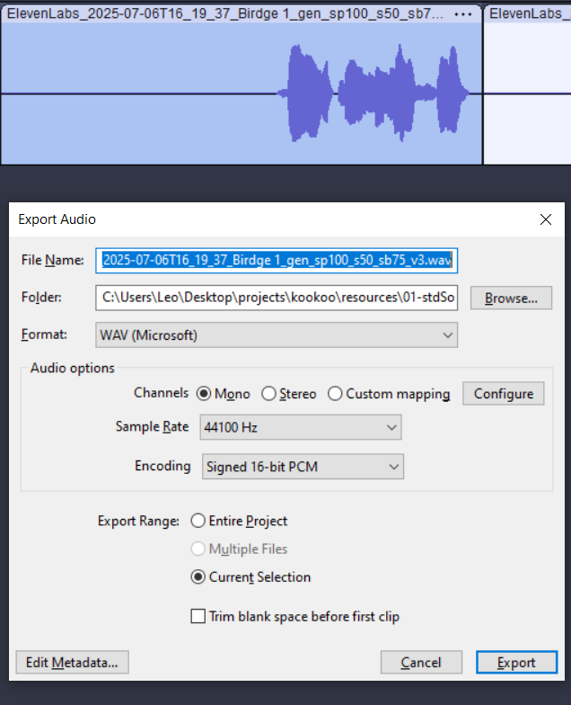

##
Format the MicroUSB in Fat32, standard allocation.
Partitioning table should be in MBR (to be verified).
## Files

Use only files with codecs that the DFPlayer Chip can play. 

One known working solution is the following:
- Open Audacity and mark a section you want to export.
- Press STRG + Shift + E (Export Audio)
  - Format: WAV (Microsoft)
  - Channels: Mono
  - Sample Rate: 44100Hz
  - Encoding: Signed 16-bit PCM
- Export Range: current section
- Export!

## Folder Structure

Example folder names: 
- ``03/001.mp3``
- ``03/002.mp3``
- ``03/003.mp3``
- ``04/001.mp3``

Folder name: only two digits ``01`` - ``13``

File name: three digits + ending e.g.: ``001.wav``. The ending can be wav or mp3.

If a folder is not used anymore, delete that folder (no empty folders)!
If you see a ``System Volume Information`` folder, dont bother, it can stay.

### Folder meaning:
- 01
  - Kookoo standard bird sound(s)
- 02
  - shake sensor activated sounds
- 03
  - one file: 001.wav
  - for the menu beep
- 04 - 13
  - 'someone comes into the room' sounds
  - press the button to iterate through these folders
  - one beep -> folder 04
  - two beeps -> folder 05
  - ...

## Note to the code developer: How does the detection of files work?
Detection of folders works by calling ``mp3Player.readFolderCounts();`` several times
and comparing if the results are the same for multiple consecutive times.
The chip detects folders with files in them.

Detection of files work by playing the first file from a folder and then asking the
chip to return the amount of files from that Folder ``mp3Player.readFileCountsInFolder(i);``.
The amount of files is requested multiple times and after multiple consecutive same answers
it is taken as correct.

Somehow this reliably works. I dont know why...

